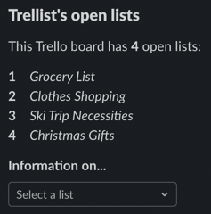

# Trellist
An easy to use Trello app for Slack, built using [py-trello](https://github.com/sarumont/py-trello).

---
## About
With Trellist, you can use the power of Trello directly from your Slack workspace. This project was created to provide an alternative, friendly interface to the Trello service through Slack as the current implementation is not user friendly.

## Features

Trellist can ...
* View board information
* View specific list information
* Create new lists
* Archive old lists
* Create/add cards to lists
* Remove cards from lists

## Commands

| Command                                | Description                                                                           |
|:---------------------------------------|:--------------------------------------------------------------------------------------|
| `/information <open/closed>`           | View board information. If parameters are passed, show information on that subset. |
| `/create-list <list_name>`             | Create a new list and add it to the board.                                            |
| `/close-list <list_name>`              | Archive a list.                                                                       |
| `/add-card <list_name>~<card_name>`    | Create a new card and add it to the list.                                            |
| `/delete-card <list_name>~<card_name>` | Remove a card from the list.                                                       |

To view information on specific lists, use the `/information <open/closed>` command (in this case, arguments are required). You can then select your specific list from a dropdown menu:

| Dropdown Selection | Specific Information |
|:-------------------|:---------------------|
|                    ||

## Roadmap
- [ ] Add board selection menu
- [ ] Add login/logout to Trello
